# CDR Pipeline - Best Case Architecture

```mermaid
flowchart LR
    %% CDR Generation with Quality
    subgraph "📞 CDR Generation Layer"
        A1["Python CDR Generator<br/>✅ Realistic call patterns<br/>✅ Data validation<br/>✅ Schema compliance"]
        A2["Data Quality Gateway<br/>✅ Schema validation<br/>✅ Business rule checks<br/>✅ Anomaly detection"]
    end
    
    %% Real-time Streaming with Processing
    subgraph "⚡ Real-time Processing"
        B1["Kafka Topics<br/>✅ CDR events<br/>✅ Call quality metrics<br/>✅ Network events"]
        B2["Spark Structured Streaming<br/>✅ Real-time aggregation<br/>✅ Window functions<br/>✅ State management"]
        B3["Real-time Analytics<br/>✅ Call volume monitoring<br/>✅ Network performance<br/>✅ Fraud detection"]
    end
    
    %% Multi-Storage Strategy
    subgraph "🗄️ Storage Layer"
        C1["HDFS Raw Zone<br/>✅ Parquet format<br/>✅ Partitioning by date<br/>✅ Compression"]
        C2["HBase Hot Data<br/>✅ Recent CDRs<br/>✅ Fast queries<br/>✅ TTL management"]
        C3["S3 Cold Storage<br/>✅ Historical data<br/>✅ Cost optimization<br/>✅ Compliance"]
    end
    
    %% Batch Processing
    subgraph "🔄 Batch Processing"
        D1["Airflow DAGs<br/>✅ CDR generation<br/>✅ ETL to PostgreSQL<br/>✅ Data quality checks"]
        D2["Incremental Processing<br/>✅ Delta Lake integration<br/>✅ ACID transactions<br/>✅ Schema evolution"]
    end
    
    %% Data Warehouse
    subgraph "🐘 PostgreSQL Data Warehouse"
        E1["Staging Layer<br/>✅ Raw CDR data<br/>✅ Type casting<br/>✅ Deduplication"]
        E2["dbt Models<br/>✅ Staging models<br/>✅ Mart models<br/>✅ Aggregations"]
        E3["Dimensional Model<br/>✅ Fact tables<br/>✅ Dimension tables<br/>✅ Slowly changing dimensions"]
    end
    
    %% Data Quality & Testing
    subgraph "🧪 Quality & Testing"
        F1["dbt Tests<br/>✅ Data quality<br/>✅ Business logic<br/>✅ Custom assertions"]
        F2["Great Expectations<br/>✅ Statistical tests<br/>✅ Data profiling<br/>✅ Anomaly detection"]
        F3["Data Observability<br/>✅ Freshness checks<br/>✅ Volume monitoring<br/>✅ Quality scores"]
    end
    
    %% ML & Analytics
    subgraph "🤖 ML & Analytics"
        G1["Feature Store<br/>✅ Call patterns<br/>✅ Customer behavior<br/>✅ Network metrics"]
        G2["ML Models<br/>✅ Fraud detection<br/>✅ Churn prediction<br/>✅ Network optimization"]
        G3["Real-time Scoring<br/>✅ Live predictions<br/>✅ Model monitoring<br/>✅ A/B testing"]
    end
    
    %% Monitoring & Alerting
    subgraph "📊 Monitoring & Alerting"
        H1["Streamlit Monitoring<br/>✅ Real-time dashboard<br/>✅ Pipeline health<br/>✅ Alert management"]
        H2["Grafana Metrics<br/>✅ System performance<br/>✅ Data quality metrics<br/>✅ Business KPIs"]
        H3["Alert System<br/>✅ Slack notifications<br/>✅ Email alerts<br/>✅ PagerDuty integration"]
    end
    
    %% Business Intelligence
    subgraph "📈 Business Intelligence"
        I1["Power BI<br/>✅ Executive dashboards<br/>✅ Self-service analytics<br/>✅ Scheduled reports"]
        I2["Tableau<br/>✅ Advanced analytics<br/>✅ Interactive visualizations<br/>✅ Mobile access"]
        I3["Custom APIs<br/>✅ RESTful endpoints<br/>✅ GraphQL queries<br/>✅ Real-time data access"]
    end
    
    %% Team Access & Governance
    subgraph "👥 Team Access & Governance"
        J1["Business Users<br/>✅ Power BI access<br/>✅ Self-service analytics<br/>✅ Role-based permissions"]
        J2["Data Team<br/>✅ Streamlit monitoring<br/>✅ dbt development<br/>✅ Quality oversight"]
        J3["Data Scientists<br/>✅ Feature store access<br/>✅ ML model training<br/>✅ Experiment tracking"]
        J4["DevOps Team<br/>✅ Infrastructure monitoring<br/>✅ Performance optimization<br/>✅ Security management"]
    end
    
    %% Connections
    A1 --> A2
    A2 --> B1
    B1 --> B2
    B2 --> B3
    B2 --> C1
    B2 --> C2
    
    C1 --> D1
    C2 --> D1
    D1 --> D2
    D2 --> E1
    
    E1 --> E2
    E2 --> E3
    E3 --> F1
    E3 --> F2
    E3 --> F3
    
    E3 --> G1
    G1 --> G2
    G2 --> G3
    
    E3 --> I1
    E3 --> I2
    E3 --> I3
    
    %% Monitoring connections
    A1 -.-> H1
    B2 -.-> H1
    C1 -.-> H1
    D1 -.-> H1
    E3 -.-> H1
    F1 -.-> H1
    G2 -.-> H1
    
    H1 --> H2
    H1 --> H3
    
    %% Team access
    I1 --> J1
    I2 --> J1
    H1 --> J2
    G1 --> J3
    H2 --> J4
    
    %% Styling
    classDef generation fill:#e3f2fd
    classDef streaming fill:#fff3e0
    classDef storage fill:#f3e5f5
    classDef processing fill:#e8f5e8
    classDef database fill:#fce4ec
    classDef quality fill:#e0f2f1
    classDef ml fill:#f1f8e9
    classDef monitoring fill:#fff8e1
    classDef bi fill:#f3e5f5
    classDef team fill:#fce4ec
    
    class A1,A2 generation
    class B1,B2,B3 streaming
    class C1,C2,C3 storage
    class D1,D2 processing
    class E1,E2,E3 database
    class F1,F2,F3 quality
    class G1,G2,G3 ml
    class H1,H2,H3 monitoring
    class I1,I2,I3 bi
    class J1,J2,J3,J4 team
```

## 🎯 **Best Case CDR Pipeline Features:**

### **1. Advanced Data Generation**
- **Realistic call patterns** based on historical data
- **Multi-format CDRs** (voice, SMS, data usage)
- **Data quality gateway** with validation

### **2. Real-time Streaming Architecture**
- **Kafka** for event streaming
- **Spark Structured Streaming** for real-time processing
- **Real-time analytics** and fraud detection

### **3. Multi-Storage Strategy**
- **HDFS** for raw data (hot)
- **HBase** for recent data (warm)
- **S3** for historical data (cold)

### **4. Advanced Batch Processing**
- **Delta Lake** for ACID transactions
- **Incremental processing** for efficiency
- **Schema evolution** support

### **5. Comprehensive Data Quality**
- **dbt tests** for business logic
- **Great Expectations** for statistical validation
- **Data observability** platform

### **6. ML Integration**
- **Feature store** for ML-ready data
- **Real-time scoring** for live predictions
- **Model monitoring** and A/B testing

### **7. Multi-Tool Monitoring**
- **Streamlit** for operational dashboards
- **Grafana** for system metrics
- **Alert system** with multiple channels

### **8. Business Intelligence**
- **Power BI** for business users
- **Tableau** for advanced analytics
- **Custom APIs** for real-time access

### **9. Team Governance**
- **Role-based access** control
- **Self-service analytics** for business users
- **DevOps integration** for infrastructure

This best-case architecture provides **scalability**, **reliability**, **real-time capabilities**, and **comprehensive monitoring** for a production-grade CDR pipeline! 🚀 