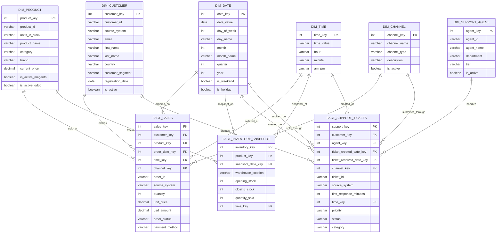

## Multisystem ETL Lakehouse for Business Insights

## pipeline-Architecture


## Layers


A production-style lakehouse that consolidates Magento, Odoo, and Freshdesk data into a unified analytics warehouse using Apache Spark and Apache Iceberg on S3-compatible storage. The pipeline builds curated Silver datasets and a Gold star schema optimized for BI and downstream analytics.

## Tech Stack and Tools
- **Aibyte**: Development assistance and code generation acceleration.
- **GitHub Codespaces**: Reproducible dev environment; provisions MinIO/Iceberg-compatible stack via Docker.
- **MinIO (S3-compatible)**: Object storage backend for Silver/Gold Iceberg tables.
- **Apache Iceberg**: Table format for reliable, ACID data lakes across Silver and Gold catalogs.
- **Apache Spark**: Distributed processing for Silver curation and Gold dimensional modeling.
- **Apache Airflow**: Orchestration of Silver and Gold workflows (DAGs in `dags/`).
- **Streamlit**: Lightweight monitoring/observability UI for pipeline status and data checks.

### Key Highlights
- **Sources**: Magento, Odoo, Freshdesk (sample schemas and CDC included)
- **Storage**: S3 (localstack-compatible) with Iceberg tables
- **Compute/Orchestration**: Spark + Airflow
- **Curated Layers**: Silver (clean/standardized) → Gold (dimensional model)


## Table of Contents
- [Overview](#multisystem-etl-lakehouse-for-business-insights)
- [Architecture](#architecture)
- [Tech Stack and Tools](#tech-stack-and-tools)
- [Requirements](#requirements)
- [Getting Started](#getting-started)
- [Catalogs and Storage](#catalogs-and-storage)
- [Silver Layer (examples)](#silver-layer-examples)
- [Gold Layer (star schema)](#gold-layer-star-schema)
- [Data Warehouse Model](#data-warehouse-model)
- [Orchestration](#orchestration)
- [Development Notes](#development-notes)
- [Explore the Code](#explore-the-code)
- [Run with Airflow](#run-with-airflow)
- [Run with spark-submit](#run-with-spark-submit)
- [Directory Layout](#directory-layout)
- [Troubleshooting](#troubleshooting)
- [License](#license)


## Architecture

The lakehouse is organized into three layers and two Iceberg catalogs on MinIO/S3 for reliability and clarity.

### Layers
- **Raw**: Landing zone for source exports/CDC. Immutable files; minimal/no transformation.
  - Storage: `s3a://multusystem/raw/...` (example; adjust per environment)
  - Examples: `magento/exports/*.parquet`, `odoo/*.parquet`, `freshdesk/*.parquet`
- **Silver (curated entities)**: Cleaned, deduplicated, typed, lightly conformed per source domain.
  - Catalog: `local` → Warehouse: `s3a://multusystem/silver_layer`
  - Examples: `local.magento_products`, `local.categories`, `local.freshdesk_customers`, `local.agents`, `local.odoo_products`
- **Gold (dimensional model)**: Star schema optimized for BI and analytics.
  - Catalog: `my_catalog` → Warehouse: `s3a://multusystem/gold_layer`
  - Dimensions: `dim_customer`, `dim_products`, `dim_support_agent`, `dim_date`, `dim_time` (optionally `dim_channel`)
  - Facts: `fact_sales`, `fact_inventory_snapshot`, `fact_support_tickets`

### Catalogs
- `local` (Silver) = curated entities; input to Gold
- `my_catalog` (Gold) = dimensional/fact model for analytics

### End-to-end flow
1) Ingest to Raw: source exports/CDC land in object storage.
2) Spark Silver transforms read latest Raw files and write Iceberg tables into `local`.
3) Gold modeling reads `local.*` and publishes star schema to `my_catalog.gold.*`.
4) BI/analytics query Gold tables; Streamlit and Airflow monitor pipeline health and runs.

See the diagrams for visuals:
- Layers: `Data Architecture/layers.png`
- Low-level flow: `Data Architecture/data flow low level.png`


## Requirements

Review the project requirements and modeling rationale in the `Requirements/` folder:
- Functional and non-functional requirements: `Requirements/Requirments.md`
- Source systems and entities: `Requirements/Identifying Data Sources.md`
- Data warehouse  schema: `Requirements/Data Warehouse Model.md`

Runtime prerequisites (local/dev):
- Docker and Docker Compose
- Python 3.10+
- Java 11+ (for Spark)
- Internet access to pull Spark/Iceberg/Hadoop AWS dependencies


## Getting Started

1) Environment variables
- Configure `airflow.env` as needed (default values are provided for local).

2) Bring up the services
```bash
docker compose up -d
```

3) Initialize storage and catalogs
- Localstack endpoint, buckets, and Spark catalogs are pre-configured in code. Buckets used:
  - `s3a://multusystem/silver_layer`
  - `s3a://multusystem/gold_layer`

4) Run Silver transforms
- Silver jobs read latest files from S3 and write curated Iceberg tables to the `local` catalog.
- You can invoke the Airflow DAG in `dags/silver_transform.py` or run the scripts in `jobs/scripts/silver_layer/` directly (inside the Spark image).

5) Run Gold modeling
- Gold scripts read from the `local` catalog and publish dimensional/fact tables to the `my_catalog` catalog under `gold_layer`.
- Trigger via the Airflow `modeling` DAG or execute the python entrypoints within `jobs/scripts/gold_modeling`.


## Catalogs and Storage

Spark sessions are configured to use two Iceberg catalogs:
- `local` (Silver) → `s3a://multusystem/silver_layer`
- `my_catalog` (Gold) → `s3a://multusystem/gold_layer`

See `jobs/scripts/gold_modeling/s3_utils.py` for the Gold session configuration and `jobs/scripts/s3_utils.py` for Silver utilities (including S3 access and helper write functions).


## Silver Layer (examples)

Silver transforms standardize each source domain into clean, deduplicated Iceberg tables. For example, Magento products and Odoo products are normalized and written to `local`:

```python
# jobs/scripts/silver_layer/transform_magento.py (excerpt)
products_df = (
    products_df.dropDuplicates(["sku"]) 
      .filter(F.col("price") > 0)
      .withColumn("name", F.initcap(F.col("name")))
      .withColumn("brand", F.upper(F.col("brand")))
)
write_to_iceberg(products_df, "magento_products")
```

```python
# jobs/scripts/silver_layer/transform_odoo.py (excerpt)
products_df = (
    products_df.dropDuplicates(["product_code"]) 
      .withColumn("product_name", F.initcap(F.col("product_name")))
      .fillna({"category": "Uncategorized", "list_price": 0.0, "standard_price": 0.0})
)
write_to_iceberg(products_df, "odoo_products")
```


## Gold Layer (star schema)

Gold modeling builds the unified star schema over the curated Silver entities. Selected snippets below.

### Dimension: Products
```python
# jobs/scripts/gold_modeling/Dimensions/dim_products.py (excerpt)
spark.sql("""
CREATE OR REPLACE TEMP VIEW unified_products AS
SELECT
    COALESCE(m.product_id, o.product_id) AS product_id,
    COALESCE(m.name, o.product_name, 'Unknown') AS product_name,
    COALESCE(m.sku, o.product_code) AS product_code,
    COALESCE(m.brand, 'Uncategorized') AS brand,
    COALESCE(m.price, o.standard_price, o.list_price, 0) AS current_price,
    COALESCE(m.is_active, o.is_active, true) AS is_active,
    COALESCE(m.created_at, o.created_at, current_timestamp()) AS created_at,
    CASE WHEN m.product_id IS NOT NULL THEN 'magento'
         WHEN o.product_id IS NOT NULL THEN 'odoo' ELSE 'unknown' END AS source_system,
    COALESCE(o.product_type, 'Stockable') AS product_type,
    COALESCE(m.subcategory_id, null) AS subcategory_id
FROM local.magento_products m
FULL OUTER JOIN local.odoo_products o
  ON m.product_id = o.product_id OR lower(m.name) = lower(o.product_name)
""")

spark.sql("""
CREATE OR REPLACE TABLE my_catalog.gold.dim_products
USING iceberg AS
SELECT * FROM enriched_products
""")
```

### Dimension: Support Agent
```python
# jobs/scripts/gold_modeling/Dimensions/dim_support_agent.py (excerpt)
spark.sql("CREATE OR REPLACE TEMP VIEW freshdesk_agents AS SELECT * FROM local.agents")

# Safer create pattern to avoid version-hint issues
spark.sql("DROP TABLE IF EXISTS my_catalog.gold.dim_support_agent")
spark.sql("""
CREATE TABLE my_catalog.gold.dim_support_agent
USING iceberg AS
SELECT
    agent_id,
    email,
    first_name,
    last_name,
    department,
    is_active,
    created_at
FROM freshdesk_agents
""")
```

Additional dimensions and facts follow the same pattern (build temp views over `local.*`, then publish to `my_catalog.gold.*`).


## Data Warehouse Model

The full star schema is documented in `Requirements/Data Warehouse Model.md`. At a glance:
- **Dimensions**: `dim_date`, `dim_time`, `dim_customer`, `dim_products`, `dim_support_agent` (plus `dim_channel` option)
- **Facts**: `fact_sales`, `fact_inventory_snapshot`, `fact_support_tickets`
- **Grains**:
  - `fact_sales`: one row per order item per day
  - `fact_inventory_snapshot`: one row per product per warehouse per day
  - `fact_support_tickets`: one row per ticket




## Orchestration

Airflow DAGs manage Silver transforms and Gold modeling:
- Silver DAG: `dags/silver_transform.py`
- Modeling DAG: `dags/modeling.py`

Run them on schedule or manually as needed (see `logs/` for run history in dev).


## Development Notes

- Iceberg table IO is S3A (Localstack compatible). Endpoints and credentials are configured in `jobs/scripts/*/s3_utils.py`.
- For brand-new Iceberg tables in S3, prefer `DROP TABLE IF EXISTS` + `CREATE TABLE AS SELECT` over `CREATE OR REPLACE TABLE` to avoid reads of non-existent metadata files.
- Keep entity naming consistent and normalized between Silver and Gold layers.


## Explore the Code

- Silver transforms: `jobs/scripts/silver_layer/`
  - Magento: `jobs/scripts/silver_layer/transform_magento.py`
  - Odoo: `jobs/scripts/silver_layer/transform_odoo.py`
  - Freshdesk: `jobs/scripts/silver_layer/transform_freshdesk.py`
- Gold modeling: `jobs/scripts/gold_modeling/`
  - Dimensions: `jobs/scripts/gold_modeling/Dimensions/`
  - Facts: `jobs/scripts/gold_modeling/Fact/`
  - Spark session (Gold): `jobs/scripts/gold_modeling/s3_utils.py`
- Airflow DAGs: `dags/`
- Requirements and modeling docs: `Requirements/`
- Architecture images: `Data Architecture/`

Tip: Click the paths above to browse all scripts and notebooks in each area.


## Run with Airflow

1) Start services
```bash
docker compose up -d
```
2) Open the Airflow UI at `http://localhost:8080` and sign in using the credentials set in `airflow.env`.
3) Enable and trigger:
- Silver DAG: `silver_transform`
- Gold modeling DAG: `modeling`

Task logs are written under `logs/` in this repository for local development.


## Run with spark-submit

You can execute modeling or silver scripts directly from a Spark container:
```bash
# Example (adjust paths for your environment)
docker compose exec spark bash -lc \
  "spark-submit \
   --packages org.apache.iceberg:iceberg-spark-runtime-3.4_2.12:1.5.0,org.apache.hadoop:hadoop-aws:3.3.4,com.amazonaws:aws-java-sdk-bundle:1.12.262 \
   /opt/spark/work-dir/jobs/scripts/gold_modeling/Dimensions/dim_products.py"
```
For local runs, ensure your Spark session config mirrors `jobs/scripts/gold_modeling/s3_utils.py` (Gold) or `jobs/scripts/s3_utils.py` (Silver).


## Directory Layout

```text
├─ codespaces/                   # docker compose for minio 
├─ dags/                         # Airflow DAGs (silver + modeling)
├─ jobs/
│  └─ scripts/
│     ├─ silver_layer/           # Source curation to Iceberg (local.*)
│     └─ gold_modeling/
│        ├─ Dimensions/          # Star schema dimensions (my_catalog.gold.*)
│        ├─ Fact/                # Star schema facts (my_catalog.gold.*)
│        └─ s3_utils.py          # Spark session for Gold
├─ Requirements/                 # Project requirements and DWH model docs
├─ Data Architecture/            # PNG diagrams (layers + data flow)
├─ docker-compose.yaml           # Local stack services
└─ README.md
```


## Troubleshooting

- Iceberg metadata hint missing: Use `DROP TABLE IF EXISTS` + `CREATE TABLE AS SELECT` for first creation on S3 (see `dim_support_agent.py`).
- Localstack/MinIO endpoint: Update endpoints and buckets in `jobs/scripts/s3_utils.py` (Silver) and `jobs/scripts/gold_modeling/s3_utils.py` (Gold) to match your environment.
- No parquet found for Silver input: Validate S3 keys and the timestamp pattern used by `get_latest_table_paths`.

## License

See `LICENSE`.

