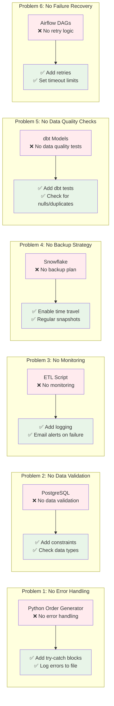

## Simple Fixes for Your Pipeline

### 1. **Error Handling** 
```python
# Instead of this:
def generate_orders():
    # your code here
    pass

# Do this:
import logging

def generate_orders():
    try:
        # your code here
        logging.info("Orders generated successfully")
    except Exception as e:
        logging.error(f"Failed to generate orders: {e}")
        # Send email alert
```

### 2. **Data Validation**
```sql
-- Add constraints to PostgreSQL
ALTER TABLE orders ADD CONSTRAINT check_amount CHECK (amount > 0);
ALTER TABLE orders ADD CONSTRAINT check_status CHECK (status IN ('pending', 'completed', 'cancelled'));
```

### 3. **Simple Monitoring**
```python
# Add to your ETL script
import smtplib
from email.mime.text import MIMEText

def send_alert(message):
    # Simple email alert
    msg = MIMEText(message)
    msg['Subject'] = 'ETL Pipeline Alert'
    msg['From'] = 'your-email@company.com'
    msg['To'] = 'admin@company.com'
    
    # Send email
    # smtp.send_message(msg)
```

### 4. **dbt Tests**
```yaml
# models/schema.yml
version: 2

models:
  - name: orders
    tests:
      - not_null:
          column_name: order_id
      - unique:
          column_name: order_id
      - accepted_values:
          column_name: status
          values: ['pending', 'completed', 'cancelled']
```

### 5. **Airflow Retries**
```python
# In your DAG
default_args = {
    'owner': 'data_team',
    'retries': 3,
    'retry_delay': timedelta(minutes=5),
    'email_on_failure': True,
    'email_on_retry': True,
}
```

### 6. **Simple Backup Strategy**
```sql
-- Enable time travel in Snowflake
ALTER TABLE orders SET DATA_RETENTION_TIME_IN_DAYS = 7;

-- Create regular snapshots
CREATE OR REPLACE TABLE orders_backup AS 
SELECT * FROM orders;
``` 